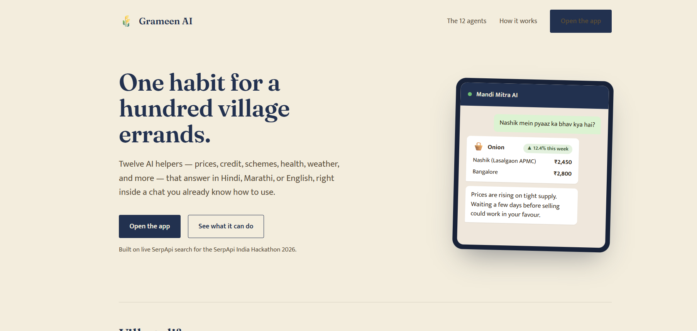
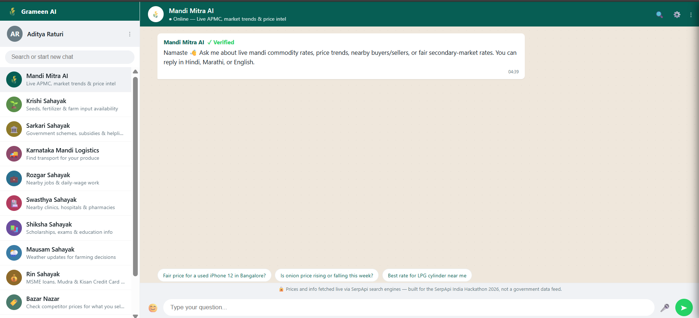
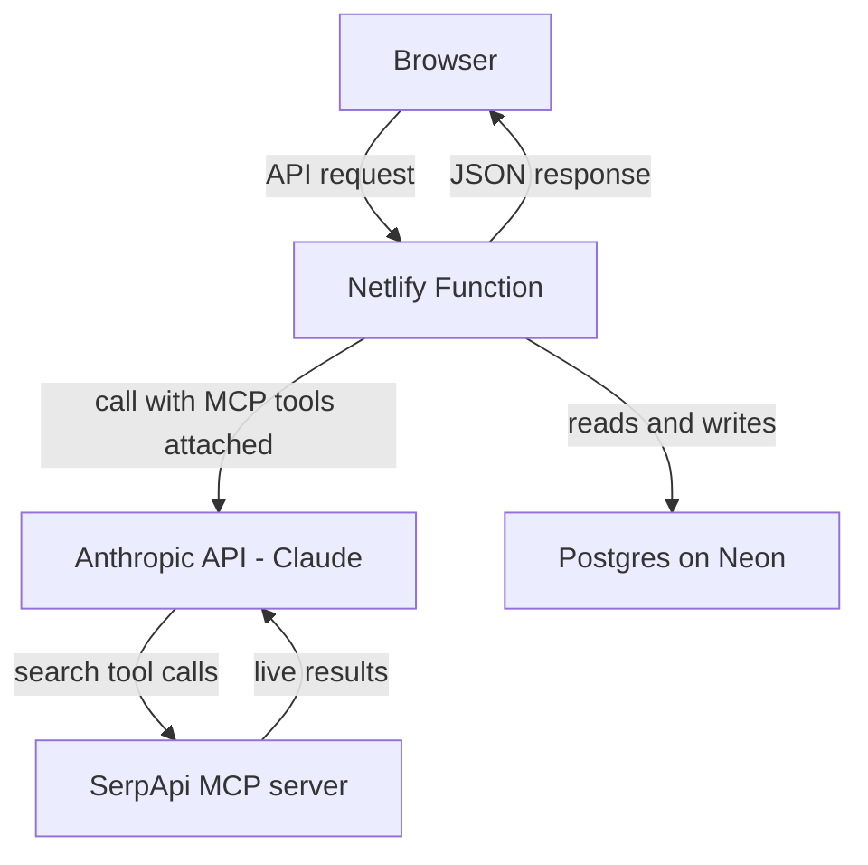

# Grameen AI

A family of WhatsApp-styled AI agents for small Indian sellers, shopkeepers,
farmers, and rural workers — built for the SerpApi India Hackathon 2026. Real
accounts, real Postgres-backed chat history, and 12 agents that each call
live SerpApi searches via the SerpApi MCP server.

## Table of contents

- [Screenshots](#screenshots)
- [The 12 agents](#the-12-agents)
- [Architecture](#architecture)
- [Setup](#setup)
- [Project structure](#project-structure)
- [Adding another agent](#adding-another-agent)
- [Known limitations](#known-limitations-be-upfront-about-these-with-judges)

## Screenshots

**Landing page**



**Mandi Mitra AI agent, with the full 12-agent sidebar**



## The 12 agents

| Agent | Helps with | SerpApi engines used |
|---|---|---|
| **Mandi Mitra AI** | Fair prices, demand trends, where to buy/sell | `google_shopping`, `google_trends`, `google_local`, `google_finance` |
| **Krishi Sahayak** | Finding seeds/fertilizer nearby and their price | `google_local`, `google_shopping` |
| **Sarkari Sahayak** | Government schemes (PM-Kisan, crop insurance, subsidies) | `google_search`, `google_news` |
| **Karnataka Mandi Logistics** | Finding transport businesses for produce | `google_local` / `google_maps` |
| **Rozgar Sahayak** | Nearby jobs & daily-wage work | `google_jobs`, `google_local` |
| **Swasthya Sahayak** | Nearby hospitals, clinics, pharmacies | `google_local` / `google_maps`, `google_search` |
| **Shiksha Sahayak** | Scholarships, exams, nearby schools/colleges | `google_search`, `google_news`, `google_local` |
| **Mausam Sahayak** | Weather updates for farming decisions | `google_search` (weather answer box) |
| **Rin Sahayak** | MSME loans, Mudra & Kisan Credit Card info | `google_search`, `google_news` |
| **Bazar Nazar** | Competitor price watch for online sellers | `google_shopping`, `google_trends` |
| **Yatra Sahayak** | Affordable travel to mandis, cities & work | `google_flights`, `google_hotels` |
| **Patent Sahayak** | Check if a product idea already exists | `google_patents` |

**Honest note on the logistics agent**: SerpApi has no live freight-matching
data, so this agent can only surface transport/logistics *businesses* found
via local search — never live truck availability or confirmed pricing. Its
system prompt always says so explicitly. Be upfront about this if a judge asks.

**Honest note on the weather agent**: Mausam Sahayak's weather data comes
from Google's aggregated weather answer box (via `google_search`), not a
dedicated meteorological API. It's fine for general farming-planning
questions but its own greeting explicitly tells users to check IMD
(mausam.imd.gov.in) for anything storm/flood-safety related.

**Honest note on the healthcare agent**: Swasthya Sahayak is a facility
*finder*, not a medical advisor — its system prompt explicitly forbids
diagnosing symptoms or recommending treatment, and redirects emergencies to
India's 108 ambulance helpline.

**Honest note on the travel agent**: Yatra Sahayak can only search flights
and hotels — SerpApi has no bus or train data, which are often the actual
cheapest/most common options for the short-to-medium routes its users need.
Its system prompt requires it to say so explicitly rather than silently only
showing flights and implying they're the best choice.

**Honest note on the patent agent**: Patent Sahayak is informational only —
its system prompt explicitly forbids stating whether something "is
patentable," since that's a legal judgment call, not a search result. It
always points users to a registered patent attorney for real filing
decisions.

**Honest note on Bazar Nazar vs. Mandi Mitra AI**: these two agents use a
similar mechanism (price search) but different scope on purpose — Mandi
Mitra AI is for agricultural/commodity prices at mandis, Bazar Nazar is for
manufactured/retail goods sold online. Worth being able to explain that
distinction clearly if a judge asks why there are two "price" agents.

## Architecture

This app runs entirely on Netlify — no separate server to host:

- **Frontend**: `public/index.html` is the marketing landing page; the actual
  product (login + chat UI) lives at `public/app.html`. Both are static files,
  no build step.
- **Backend**: one Netlify Function (`netlify/functions/api.mts`) handling
  every `/api/*` route. Netlify Functions use the standard web
  `Request`/`Response` objects, not an Express-style `(req, res)` callback —
  if you're used to Express, this is the main mental shift.
- **Database**: real Postgres via the `@netlify/database` package, pointed at
  a **bring-your-own connection string** (`DATABASE_URL`) — this project uses
  a free [Neon](https://neon.tech) database directly, since Netlify's own
  managed database (same underlying tech, resold by Netlify) requires a
  paid/credit-based plan. Same `db.sql` query API either way.



Each `/api/chat` request: the function checks the session cookie, loads that
user's history for the chosen agent from Postgres, sends it to Claude with
the agent's own system prompt and the SerpApi MCP server attached as a tool
source, gets back a structured JSON reply, saves both turns to Postgres, and
returns the parsed result to the browser.

### Why this replaced the earlier Express + JSON-file version

The original prototype ran a normal long-lived Express server with a JSON
file as a makeshift database. That could never have worked once deployed on
Netlify — Netlify runs your backend as serverless functions, which don't
have a persistent local disk between requests. Moving to a real Postgres
database wasn't just a safety upgrade, it was required for deployment to
work at all.

### Shared response schema

Each agent has its own system prompt (see `agents.mjs`) but they all share
**one JSON output schema** — a deliberate scope-control choice: one generic
result card in the frontend (`addResultCard` in `public/app.html`) renders
all 12 agents' answers, instead of building 12 separate card layouts under
hackathon time pressure.

## Setup

**Requirements:** Node.js 18+, a Netlify account, and the Netlify CLI
(installed automatically as a dev dependency).

1. Install dependencies:
   ```
   npm install
   ```

2. Log in to Netlify and link this project to a Netlify site (creates one if
   you don't have one yet):
   ```
   npx netlify login
   npx netlify init
   ```

3. Create a free Postgres database at [neon.tech](https://neon.tech) (no card
   required for the free tier). In Neon's SQL Editor, run the contents of
   `netlify/database/migrations/20260919120000_init/migration.sql` once to
   create the `users` and `messages` tables — Netlify's automatic migration
   runner only applies to its own paid-tier database, not an external one.
   Copy your project's Postgres connection string from Neon's dashboard.

4. Create a `.env` file in the project root with the following (fill in your
   own real values — never commit this file, it's already in `.gitignore`):
   ```
   ANTHROPIC_API_KEY=your_anthropic_api_key_here
   SERPAPI_API_KEY=your_serpapi_api_key_here
   JWT_SECRET=any_long_random_string
   DATABASE_URL=your_neon_connection_string_from_step_3
   ```
   Generate a `JWT_SECRET` with:
   ```
   node -e "console.log(require('crypto').randomBytes(32).toString('hex'))"
   ```

5. Start local development:
   ```
   npm run dev
   ```
   This opens the app at whatever local URL `netlify dev` prints (usually
   http://localhost:8888).

6. When you're ready to deploy for real:
   ```
   npm run deploy
   ```
   For production, set your environment variables as real Netlify env vars
   (Site settings → Environment variables, or `netlify env:set KEY value`)
   rather than relying on your local `.env` file, which never gets deployed.

## Project structure

```
grameen-ai/
├── netlify.toml                        # Points Netlify at public/ + netlify/functions
├── netlify/
│   ├── functions/
│   │   └── api.mts                      # The one backend function — all /api/* routes
│   └── database/
│       └── migrations/
│           └── 20260919120000_init/
│               └── migration.sql        # users + messages tables — run manually against Neon (see Setup)
├── agents.mjs                           # All 12 agents' config + system prompts + shared JSON schema
├── public/
│   ├── index.html                       # Marketing landing page
│   └── app.html                          # Auth screen + full chat UI (vanilla JS, no build step)
├── package.json
└── .gitignore
```

## Adding another agent

Add one object to the `agents` array in `agents.mjs` (id, name, icon, color,
tagline, greeting, sampleQuestions, systemPrompt following the shared JSON
schema documented at the top of that file). Nothing else needs to change —
the sidebar, chat rendering, and history are all driven off `/api/agents`.

## Cost: this runs on free tiers

Netlify's own managed database requires a paid/credit-based plan, which is
why this project uses a free [Neon](https://neon.tech) Postgres database
directly instead (see Setup, step 3). Netlify's site hosting and Functions
stay within their free tier for hackathon-scale traffic. The only real,
unavoidable cost is Anthropic API usage for the chat calls themselves.

## Known limitations (be upfront about these with judges)

- No password reset flow, no email verification.
- The model's JSON output is parsed with a graceful fallback to plain text if
  it doesn't match the schema exactly — some responses may show as plain
  bubbles instead of rich cards until the prompts are tuned against real,
  live usage.
- The logistics, weather, travel, healthcare, and patent agents each have a
  specific, disclosed data limitation — see the "Honest note" callouts above.
- Location-aware queries rely on the user typing a place name; no automatic
  geolocation yet.
- Local dev (`netlify dev`) has a hard 30-second synchronous function
  timeout; a query needing multiple SerpApi calls can occasionally hit it.
  Production deploys get 60 seconds instead.
